<h2> Hi, I'm Jon Lara! </h2>

<em>Backend developer at <a href="https://rebellionpay.com">Rebellion pay</a>  Studying at <a href="https://deusto.es">University of Deusto</a>
</em>

 <em><b>I love coding!</b> :)</em>

---

